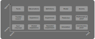

# Frame v0.0.0a

This is initial Frame by _Niurop_.

## Argument ranking

The ranking is 2-dimensional.

One is between what we need to `Agree on` and of what we can have `Certenty scale`, in short will be called `Certenty`. The other is between how close it is to `Reality` and of how `Pure` it is, in short, will be called `Reality scale`.

What we care about is as close to as possible to `Certenty` and `Reality` (since we aim at objective Truth that describes actual reality). However, reality is messy and hard to argue about. Often we need to first agree on something to then argue about it and validate our ideas. Even more problematic is that we can disagree even on what we see, but more pure ideas tend to be more objective and verifiable. It would be much simpler if pure Mathematical reasoning would explain everything, but it only deals with what is simple and tends to have many assumptions.

#TODO: explain elements with examples

## Process overview

#TODO: explain the process with examples

## Validation

#TODO: present argument that this process should work